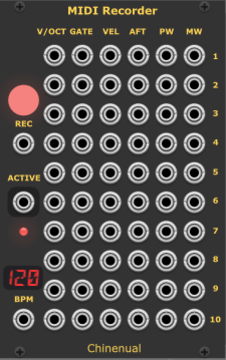

# Chinenual-VCV

Virtual Eurorack modules for [VCV Rack](https://vcvrack.com), available in the [plugin library](https://library.vcvrack.com/).

**(NOTE: not yet submitted to the library - pending beta testing).**

Feedback and bug reports (and [donations](https://paypal.me/chinenual)) are always appreciated!

The [Changelog](./CHANGELOG.md) describes changes.

## Modules

* [MIDI Recorder](#midi-recorder) - a polyphonic multi-track recorder
  to convert CV to standard MIDI files.
  
* [MIDI Recorder CC](#midi-recordercc) - an expander for the recorder
  to capture CV as CC values. Supports both 7- and 14-bit CC.

### MIDI Recorder

A multi-track recorder to capture a VCV performance to a standard MIDI
file.   Supports up to 10 polyphonic tracks, converting CV in the same
way the VCV core CV-MIDI module does.

Each row of inputs corresponds to one track of MIDI. 

#### Motivation

I run VCV Rack on a fairly low performance laptop (by current
standards).  I can't run Rack and a DAW at the same time, so I can't
just stream MIDI out of Rack and record it in my DAW.   I suspect I'm
not alone.   This module lets me capture 10 tracks of MIDI into a standard MIDI
file and then import it into my DAW.

####  How it works

* **RUN**  - If the **GATE** input is unconnected, you can press
  this button to start and end the recording.  It changes color to red
  while recording.
  
* **GATE** - You can control the recording start/stop with a gate
  signal (e.g. from Count Modula's FADE module).   Recording starts
  when the signal
  is above 0.0v; stops when it drops to or below 0.0v.   The Run
  button turns red during recording.
  
* **BPM** - Use this to set the tempo of the MIDI file.  Uses same
  conventions as Impromptu's CLOCKED BPM output (BPM = 120 * 2^voltage).  If unconnected, sets the MIDI tempo
  to 120 BPM.  An LED style display shows the BPM.

The remaining inputs accept the same signals as the VCV core
CV-MIDI module, each row feeding a separate polyphonic track in the
target MIDI file.  CV input voltage ranges default to the same ranges
used by the VCV 
CV-MIDI module, however the VEL, AFT, PW and MW input ranges can be
changed to better match your modulation sources.  

* **V/OCT** - polyphonic. Note pitch (1V/oct)
* **GATE** - polyphonic. Note gates (0 .. 10V)
* **VEL**  - polyphonic. Note velocity (default: 0 .. 10V).  Defaults to 100 if unconnected.
* **AFT** - polyphonic. Aftertouch/Key Pressure (default: 0V .. 10V)
* **PW** - monophonic. Pitchbend (default: -5V .. 5V)
* **MW** - monophonic. Mod Wheel (default: 0V .. 10V).  Can optionally
  be set to capture 14bit values (see [About 14bit](#about-14bit) below).

Target file selection works in a similar way to the VCV Recorder
module.  You can select a file from the context menu, or if none has
been selected, you'll get a popup dialog the first time you try to
record something. 

Right-click Context menu:

* **Output File** - the path to the target MIDI file to be produced.
* **Append -001, -002, etc.** - If checked, the recorder creates unique files if the target
  file already exists (`/my/file.mid`,  `/my/file-001.mid`,
  `/my/file-002.mid`, ...). If unchecked, the file is overwritten.
* **Start at first note gate** - when checked (the default), even
  after the recording is "started", the
  recording is delayed until it sees the first note.  This ensures that the
  resulting midi events are aligned to the beginning of a bar.   This
  also means that any non-note events (PW, MW, AFT) will be ignored
  until that first note plays.    Turn this off to record the events
  immediately (in which case you may need to shift the events in your
  DAW to get them to line up nicely on a bar division.
* **VEL Input Range** - sets the input CV range for the VEL inputs.
  Defaults to 0..10V.
* **AFT Input Range** - sets the input CV range for the AFT inputs.
  Defaults to 0..10V.
* **PW Input Range** - sets the input CV range for the PW inputs.
  Defaults to -5..5V.
* **MW Input Range** - sets the input CV range for the MW inputs.
  Defaults to 0..10V.
* **MW is 14bit** - Capture MW as 14bit rather than the default
  7bit. Emits two CC values (CC1 and CC33) when enabled.  See
  [About 14bit](#about-14bit) below). 

### MIDI RecorderCC

An expander for the MIDI Recorder that adds support for capturing
arbitrary CC values.   The expander must be adjacent to the recorder,
and to its right.  Any number of expanders can be used. When using
more than one, just place them next to each other, all to the right of
the master recorder module:

Each column of CC values is configured via  the Right-click Context menu:

* **Input Range** - sets the input CV range for that column of
  inputs. Defaults to 0..10V.
* **14bit** - Capture as 14bit rather than the default
  7bit. Emits two CC values (CCx and CCx+32) when enabled.  See
  [About 14bit](#about-14bit) below). 
* **MIDI CC** - The CC number.   

### About 14bit

If 14-bit CC is selected, two CC messages are created.  One at the
configured control number (with the MSB part of the value) and one at
control number+32 (with the LSB part).

**WARNING:** 
The module does not attempt to prevent you from configuring
conflicting CC's (e.g. if column 1's settings are CC=2, 14-bit, and
column 2's is CC=34, both columns will be producing CC messages for
CC=34.  It does not prevent you from creating 14-bit CC pairs outside
the "normal" range defined by the MIDI spec (only CC0 through CC31
have well defined paired CC's from 32 through 63, but the module will
allow you to specify, for example, CC70 as 14 bit, which will emit
CC70(MSB) and CC102(LSB)).   If the LSB part of the value would extend
beyond the maximum legal 127 CC number, it is silently omitted.

Also note that the MW column on the master recorder produces CC1 (and
optionally CC33 if configured for 14bit).

## Acknowledgements

The MIDIRecorder leverages builtin functionality of the VCV Rack core
MIDI support and uses the same third party MIDI File library as
Squinky Lab's SEQ++ (Craig Stewart's [midifile](https://github.com/craigsapp/midifile) library). 

