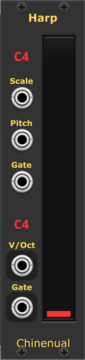
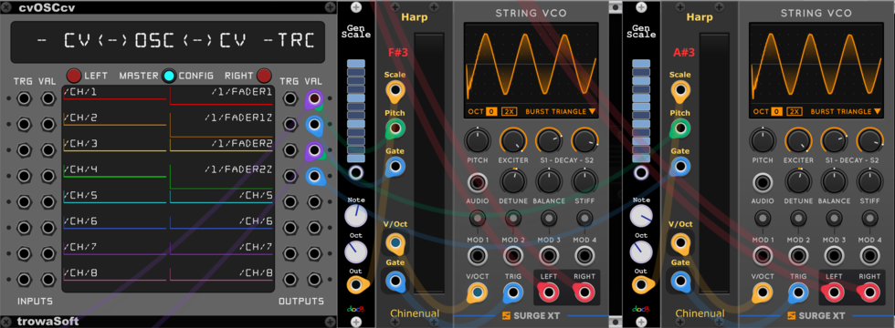

# Chinenual-VCV

Virtual Eurorack modules for [VCV Rack](https://vcvrack.com), available in the [plugin library](https://library.vcvrack.com/).

Feedback and bug reports (and [donations](https://paypal.me/chinenual)) are always appreciated!

The [Changelog](./CHANGELOG.md) describes changes.

## Modules

 
 
 
 
 
 
 

* [MIDI Recorder](#midi-recorder) - a polyphonic multi-track recorder
  to convert CV to standard MIDI files.
  
* [MIDI Recorder CC](#midi-recordercc) - an expander for the recorder
  to capture CV as CC values. Supports both 7- and 14-bit CC.

* [DrumMap](#drummap) - Accepts percussion GATE inputs and converts them to General MIDI pitch v/oct.

* [Tintinnabulator](#tintinnabulator) - Produce a harmonized pitch from an input chord and melody using Arvo Pärt-style tintinnabulation.

* [NoteMeter](#notemeter) - a polyphonic metering module that displays note names from V/Oct inputs.

* [Inv](#inv) - Produce a chromatically inverted V/oct pitch relative to a specified "pivot" pitch.

* [SplitSort](#splitsort) - Split a polyphonic cable and optionally sort the channels, with possibility to share sort criteria with another SplitSort or MergeSort.
  
* [MergeSort](#mergesort) - Merge monophonic cables into a  polyphonic output and optionally sort the channels, with possibility to share sort criteria with another SplitSort or MergeSort.

* [PolySort](#polysort) - Sort polyphonic signals, optionally reusing the same sort order as other inputs.

* [Harp](#harp) - a reimagining of Iasos's Golden Harp.  Maps a continuous pitch CV input signal to a scale and generates gated notes as you "strum".
  
### MIDI Recorder

A multi-track recorder to capture a VCV performance to a standard MIDI
file.   Supports up to 10 polyphonic tracks, converting CV in the same
way the VCV core CV-MIDI module does.

Each row of inputs corresponds to one track of MIDI. 

#### Motivation

I originally ran VCV Rack on a fairly low performance laptop (by current
standards).  I couldn't run Rack and a DAW at the same time, so I couldn't
just stream MIDI out of Rack and record it in my DAW.   I suspect I'm
not alone.   This module lets me capture 10 tracks of MIDI into a standard MIDI
file and then import it into my DAW.

####  How it works

* **REC**  - If the **REC** gate input is unconnected, you can press
  this button to start and end the recording.  It changes color to red
  while recording.
  
* **REC** - You can control the recording start/stop with a gate
  signal (e.g. from Count Modula's FADE module).   Recording starts
  when the signal
  is above 0.0v; stops when it drops to or below 0.0v.   The Run
  button turns red during recording.
  
* **BPM** - Use this to set the tempo of the MIDI file.  Uses same
  conventions as Impromptu's CLOCKED BPM output (BPM = 120 * 2^voltage).  If unconnected, sets the MIDI tempo
  to 120 BPM.  An LED style display shows the BPM.

* **ACTIVE** - This output gate is high when the recorder is actively
   capturing events.  It can be used to synchronize
  the MIDI Recoding with an audio recording.  When **Align At First
  Note** is enabled, this goes high after the first note is
  detected, else as soon as the recording is started.
  
*  An LED under the **ACTIVE** port lights up when the recorder
   is capturing events (it lights up when the **ACTIVE**
   gate is high).

   
The remaining inputs accept the same signals as the VCV core
CV-MIDI module, each row feeding a separate polyphonic track in the
target MIDI file.  CV input voltage ranges default to the same ranges
used by the VCV 
CV-MIDI module, however the VEL, AFT, PW and MW input ranges can be
changed to better match your modulation sources.  

* **V/OCT** - polyphonic. Note pitch (1V/oct)
* **GATE** - polyphonic. Note gates (0 .. 10V)
* **VEL**  - polyphonic. Note velocity (default: 0 .. 10V).  Defaults to 100 if unconnected.
* **AFT** - polyphonic. Aftertouch/Key Pressure (default: 0V .. 10V)
* **PW** - monophonic. Pitchbend (default: -5V .. 5V)
* **MW** - monophonic. Mod Wheel (default: 0V .. 10V).  Can optionally
  be set to capture 14bit values. See [About 14bit](#about-14bit) below.

If **GATE** is connected, but **V/Oct** is not, the recorder supplies a default note value to each channel of the **GATE** (starting at C4, ascending by semitone for each channel of the input).  This makes it easier to record percussion sequences.  See the [DrumMap](#drummap) module as another way to assign useful pitch values for drum gate inputs.

Target file selection works in a similar way to the VCV Recorder
module.  You can select a file from the context menu, or if none has
been selected, you'll get a popup dialog the first time you try to
record something. 

Right-click Context menu:

* **Output File** - the path to the target MIDI file to be produced.
* **Append -001, -002, etc.** - If checked, the recorder creates unique files if the target
  file already exists (`/my/file.mid`,  `/my/file-001.mid`,
  `/my/file-002.mid`, ...). If unchecked, the file is overwritten.
* **Start at first note gate** - when checked (the default), even
  after the recording is "started", the
  recording is delayed until it sees the first note.  This ensures that the
  resulting midi events are aligned to the beginning of a bar.   This
  also means that any non-note events (PW, MW, AFT) will be ignored
  until that first note plays.    Turn this off to record the events
  immediately (in which case you may need to shift the events in your
  DAW to get them to line up nicely on a bar division.
* **VEL Input Range** - sets the input CV range for the VEL inputs.
  Defaults to 0..10V.
* **AFT Input Range** - sets the input CV range for the AFT inputs.
  Defaults to 0..10V.
* **PW Input Range** - sets the input CV range for the PW inputs.
  Defaults to -5..5V.
* **MW Input Range** - sets the input CV range for the MW inputs.
  Defaults to 0..10V.
* **MW is 14bit** - Capture MW as 14bit rather than the default
  7bit. Emits two CC values (CC1 and CC33) when enabled.  See
  [About 14bit](#about-14bit) below. 

### MIDI RecorderCC

An expander for the MIDI Recorder that adds support for capturing
arbitrary CC values.   The expander must be adjacent to the recorder,
and to its right.  Any number of expanders can be used. When using
more than one, just place them next to each other, all to the right of
the master recorder module:

Each column of CC values is configured via  the Right-click Context menu:

* **Input Range** - sets the input CV range for that column of
  inputs. Defaults to 0..10V.
* **14bit** - Capture as 14bit rather than the default
  7bit. Emits two CC values (CCx and CCx+32) when enabled.  See
  [About 14bit](#about-14bit) below. 
* **MIDI CC** - The CC number.   

### About 14bit

If 14-bit CC is selected, two CC messages are created.  One at the
configured control number (with the MSB part of the value) and one at
control number+32 (with the LSB part).

**WARNING:** 
The module does not attempt to prevent you from configuring
conflicting CC's (e.g. if column 1's settings are CC=2, 14-bit, and
column 2's is CC=34, both columns will be producing CC messages for
CC=34.  It does not prevent you from creating 14-bit CC pairs outside
the "normal" range defined by the MIDI spec (only CC0 through CC31
have well defined paired CC's from 32 through 63, but the module will
allow you to specify, for example, CC70 as 14 bit, which will emit
CC70(MSB) and CC102(LSB)).   If the LSB part of the value would extend
beyond the maximum legal 127 CC number, it is silently omitted.

Also note that the MW column on the master recorder produces CC1 (and
optionally CC33 if configured for 14bit).

### DrumMap 

 

DrumMap converts input percussion/drum gate inputs to pitch outputs corresponding to user-selectable General MIDI conventions.  Use it to produce a polyphonic "drum track" with MIDIRecorder, or connect it directly to an external drum machine or DAW with VCV core's CV-MIDI.

Click on the input pair label to change the MIDI note to be associated with that gate. 

Produces three polyphonic outputs **V/Oct**, **Gate** and **Vel** suitable for directly importing into the MIDIRecorder or sent out through CV-MIDI.

### Tintinnabulator

 

Produce a harmonized pitch from an input chord and melody using Arvo
Pärt-style tintinnabulation where a harmony note is selected from a
reference chord.  Pärt's music tends to use simple triads for his
tintinnabulation but the module allows you to specify any set of notes
as the reference.  
  
The module supports several variants of the harmonization - select
first available pitch or next one, in both upwards or downwards
direction.  Also supports bidirectional tintinnabulation, where every
other note switches between upward or downwards selection.  An Octave
offset can be used to offset the harmony up or down from the reference
melody line. 
  
Controls:
 * **Mode** - controls the algorithm used to select the harmony value.
   Options are:
   * "Up" - next chord note higher than the melody
   * "Down" - next chord note lower than the melody
   * "Up/Down" - alternating up or down 
   * "Up+1" - second chord note higher than the melody
   * "Down-1" - second chord note lower than the melody
   * "Up+1/Down-1" - alternating up or down 
   * "Quantize" - Choose the "closest" note (which may be itself).
      This is technically not "tintinnabulation" since if the melody
      note matches a chord note, it will not create a "harmony" note.
      However, this allows the Tintinnabulator to be used as a general
      purpose "chord quantizer".
   
* **Octave** - offset the resulting harmony note by up to three
  octaves up or down.
  
 Inputs:
 
 * **Chord** - the notes defining the reference chord (polyphonic:
   V/Oct).   Aaron Static's ChordCV produces a suitable signal.  The
   chord frequencies need not be 12 note equal-temperament.  The
   resulting harmony notes will be chosen to match whatever tuning
   system is used in the chord input. The Tintinnabulator uses the
   reference chord to layout notes in a normalized octave, then
   replicates that quantization throughout the full voltage range,
   repeating the pattern for every octave. 
   
 * **Melody** - the pitches to be harmonized.  (polyphonic: V/Oct).
 
 * **Gate** - when using one of the bidirectional modes, the gate
   input is used to signal the harmonizer to switch direction
   (monophonic).  Can be left unpatched if using a unidirectional
   mode. 

Outputs:

* **Tint** - the resulting harmony pitches (polyphonic: V/Oct). 

* **Mix** - The original melody and harmony pitches mixed into a
  common polyphonic output (polyphonic: V/Oct).

### NoteMeter

 

NoteMeter is a polyphonic metering module that displays note names
from V/Oct inputs.	If the input voltage does not align exactly with a
note voltage it indicates the deviance from the closest note as
"cents". 
 
### Inv

 
 
   
Inv produces a chromatically inverted V/oct pitch relative to a specified "pivot" pitch. Consider quantizing the resulting signal to approximate diatonic inversion.

 Inputs:
 
 * **Pivot** - the pitch/frequency around which the melody should be
   inverted. (monophonic: V/Oct). 
      
 * **Melody** - the pitches to be inverted.  (polyphonic: V/Oct).

Outputs:

* **Inv** - the resulting inverted pitches (polyphonic: V/Oct). 

* **Mix** - The original melody and inverted pitches mixed into a
  common polyphonic output (polyphonic: V/Oct).

### SplitSort

 

Splits a polyphonic cable and optionally sorts the channels, with possibility to share sort criteria with another SplitSort or MergeSort.

Buttons:

* **Sort** - sort the signals when pressed. 

Inputs:

* **In** - the polyphonic cable to be split.

* **Link** - if connected, sort based on the values in the Link rather than the values in the Input.  This allows multiple modules to be sorted in the same order. Can be daisy chained - the first module in the chain determines the sort order.

Outputs:

* **Out** - 16 separate outputs, one for each channel of the Poly input. 

* **Link** - a polyphonic signal that can be used to control the sort order of another MergeSort or SplitSort module.  Can be daisy chained - the first module in the chain determines the sort order.

For example, a set of three SplitSort modules can be used to sort incoming MIDI note/gate/velocity all sorted by the same V/Oct criteria:

 

See [PolySort](#polysort) for an alternate approach.

### MergeSort

 

Merges a set of monophonic signals into a polyphonic cable and optionally sorts the channels, with possibility to share sort criteria with another SplitSort or MergeSort.

Buttons:

* **Sort** - sort the signals when pressed. 

Inputs:

* **In** - 16 separate inputs, one for each channel of the Poly output.  

* **Link** - if connected, sort based on the values in the Link rather than the values in the Inputs.  This allows multiple modules to be sorted in the same order. Can be daisy chained - the first module in the chain determines the sort order.

Outputs:

* **Out** - the polyphonic output.

* **Link** - a polyphonic signal that can be used to control the sort order of another MergeSort or SplitSort module.  Can be daisy chained - the first module in the chain determines the sort order.

### PolySort

 

Sort polyphonic signals, optionally reusing the same sort order as other inputs. Sorted output remain in sync with one another at the sample level.

Buttons:

* **Link** - When pressed, the input is sorted using the same sort order as the input above it.  When unpressed, the input is sorted on its own. 

Inputs:

* **In** - 10 separate polyphonic inputs.  

Outputs:

* **Out** - 10 polyphonic sorted output corresponding to each input.

For example, an alternate way to sort MIDI similar to the example above for [SplitSort](#splitsort) would be:

 

### Harp

 

A reimagining of [Iasos's](https://iasos.com) "Golden Harp".
Maps a continuous pitch CV input signal to a scale and generates gated notes as you "strum".

<!--  -->

Iasos was, by most accounts, one of the originators of New Age music.
I had the privilege of working with him in [modernizing his Golden Harp](https://chinenual.com#iasoss-golden-harp) (it originally relied on software running on a Commodore64; I replaced that with a small Arduino based controller.)  The harp is a unique instrument that used the chicklet strips on a Colortone Pro music keyboard.  Iasos would strum those chicklets like a harp.  (he used several dozen scales; each had a different musical and emotional effect in his music).  

There really is nothing currently available to replicate what his harp could do.  The closest you might get is a ribbon controller or iPad and some specialized software.

This is that specialized software. 

Inputs:

* **Scale** - Defines the notes of the scale to be strummed (V/Oct, polyphonic).  Channel 0 is treated as the "root" of the strum range.   The expected format is compatible with docB's Gen Scale and Aaron Static's ScaleCV modules.

* **Pitch** - The CV signal from the control surface. Not V/Oct; just a continous range of voltage that corresponds to where the musicians fingers are touching the control surface.  Valid voltage range is determined by context menu (see below).

* **Gate** - When non-zero, the musician's fingers are strumming.  Notes are triggered when the computed scale pitch changes.

Outputs:

* **V/Oct** - pitch of the strummed note.  Polyphonic.  Strummed notes cycle through the polyphonic channels to allow notes to "ring" and decay even when strumming quickly.

* **Gate** - gate of the strummed note. Polyphonic.

The signal range of the control surface is configured via the context menu:

* **Number of notes mapped to the input CV pitch range** - the number of scale notes mapped to the input signal.   Adjust this to your control surface size - a smaller control surface will likely require a smaller number of notes than a control surface with a longer "throw". 

* **Pitch CV Input Range** - the voltage range of the CV signal patched into the **Pitch** input

#### Differences from the Real Thing

 

* Iasos's Golden Harp's chicklet strips provide a tactile feedback - you can feel where your fingers are as you strum up and down the strip.  The iPad based OSC interface, or ribbon cable provides no such feedback.

* The musician can change scales and root notes on the fly.  This could be emulated by mapping a control surface button control the scale generator.

* The strips are polyphonic - you can trigger more than one note at a time.  Harp only emulates the "strum the strip like a harp" mode - which was how Iasos used the instrument most of the time.

* The physical size of the strummable surface is quite a bit larger than an iPad and most ribbon controllers.  It is about 19" long and the strip has 27 and 29 notes (one strip had two fewer keys).

#### Harp TouchOSC Control Surface

 

[OSCHarp.touchosc](https://github.com/chinenual/Chinenual-VCV/releases/latest)

Harp does not depend on any particular control surface and can be configured to work with a variety of CV input ranges.  You can use it with anything that can create a continuous voltage as the musician "strums" (could be a slider on a MIDI control surface, a ribbon controller, etc.)   I've created a simple control surface for the iPad using TouchOSC.  Use Trowasoft's cvOSCcv to convert its OSC messages to CV:

* **/1/fader1** - Left pitch - sends 0.0 through 10.0 corresponding to where the left control strip is being touched.
* **/1/fader1/z** - Left gate - 1 when the user is touching the left control strip; 0 when not touching
* **/1/fader2** - Right pitch - sends 0.0 through 10.0 corresponding to where the right control strip is being touched.
* **/1/fader2/z** - Right gate - 1 when the user is touching the right control strip; 0 when not touching

Works best when wired with a direct USB connection.  Be sure to enable "touch messages" (/z). 

## Acknowledgements

The MIDIRecorder leverages builtin functionality of the VCV Rack core
MIDI support and uses the same third party MIDI File library as
Squinky Lab's SEQ++ (Craig Stewart's [midifile](https://github.com/craigsapp/midifile) library). 
MergeSort and SplitSort are reimplementations of Aria Salvatrice's Splort and Smerge modules.
